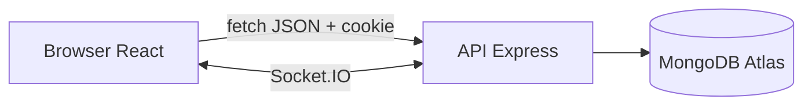
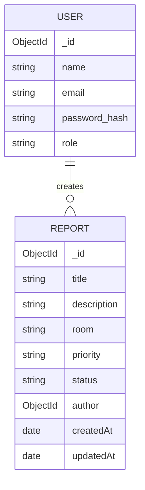
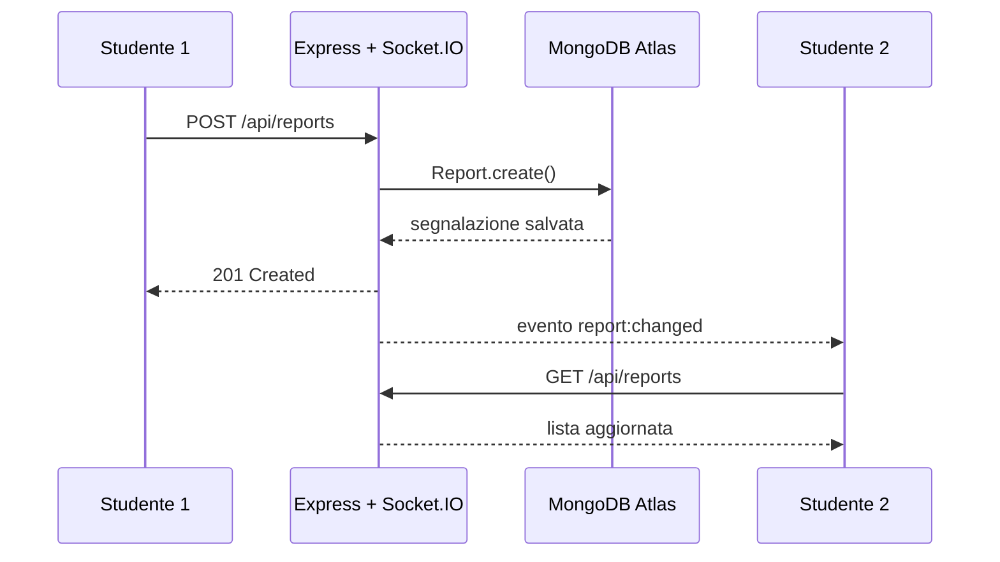

# Relazione tecnica - AulaFix

## 1. Scenario applicativo

AulaFix e una bacheca web condivisa per segnalare piccoli problemi nelle aule universitarie, per esempio un proiettore guasto, una presa non funzionante o una sedia rotta. Lo studente puo inserire una segnalazione e seguirne lo stato. Un tecnico con ruolo `admin` puo gestire tutte le segnalazioni.

L'applicazione e una Single Page Application: React genera l'interfaccia nel browser e comunica con le API JSON del backend Express. I dati sono salvati su MongoDB Atlas.

### Attori

- **Visitatore:** puo registrarsi o effettuare il login.
- **Studente:** vede e filtra la bacheca, crea segnalazioni e modifica o elimina le proprie.
- **Tecnico admin:** puo anche modificare o eliminare le segnalazioni di altri utenti.


## 2. Architettura



Il frontend usa la porta 5173 durante lo sviluppo e il backend la porta 5000. Il proxy di Vite inoltra `/api` e `/socket.io`, quindi il browser usa sempre richieste semplici alla propria origine. In produzione Express serve anche i file generati dalla build React.

### Struttura essenziale

```text
AulaFix/
  backend/
    controllers/     logica delle API
    middleware/      autenticazione, logger ed errori
    models/           schemi Mongoose
    routes/           router Express
    server.js         configurazione e Socket.IO
    swagger.js        specifica OpenAPI
  frontend/
    src/App.jsx       componenti e logica React
    src/style.css     CSS from scratch
  docs/               relazione e diagramma UML
```

## 3. Modello dei dati



### User

| Campo | Tipo | Regole |
| --- | --- | --- |
| `name` | String | obbligatorio, massimo 40 caratteri |
| `email` | String | obbligatorio, unico, in minuscolo |
| `password` | String | minimo 8 caratteri; nel database viene salvato soltanto l'hash bcrypt |
| `role` | String | `student` oppure `admin` |

### Report

| Campo | Tipo | Regole |
| --- | --- | --- |
| `title` | String | obbligatorio, massimo 80 caratteri |
| `description` | String | obbligatoria, massimo 300 caratteri |
| `room` | String | obbligatoria, massimo 30 caratteri |
| `priority` | String | `bassa`, `media`, `alta` |
| `status` | String | `aperta`, `in-lavorazione`, `risolta` |
| `author` | ObjectId | riferimento a `User` |

## 4. API backend

La documentazione Swagger completa si apre su `/api-docs`. Le rotte protette usano il middleware `protect`.

| Metodo | Rotta | Input principale | Autenticata | Funzione |
| --- | --- | --- | --- | --- |
| POST | `/api/auth/register` | body: name, email, password | No | registra e crea la sessione |
| POST | `/api/auth/login` | body: email, password | No | verifica le credenziali |
| POST | `/api/auth/logout` | cookie | No | elimina il cookie |
| GET | `/api/auth/me` | cookie | Si | legge l'utente corrente |
| GET | `/api/reports` | query: search, status, priority | Si | lista filtrata |
| GET | `/api/reports/stats` | nessuno | Si | conteggi tramite `aggregate` |
| GET | `/api/reports/:id` | param: id | Si | lettura singola |
| POST | `/api/reports` | body: dati segnalazione | Si | creazione |
| PUT | `/api/reports/:id` | param id + body | Si | modifica autorizzata |
| DELETE | `/api/reports/:id` | param: id | Si | eliminazione autorizzata |

### Query Mongoose utilizzate

- `findOne` cerca un utente per email.
- `findById` cerca utenti e segnalazioni tramite il parametro `id`.
- `find` elenca le segnalazioni usando filtri costruiti dalle query string.
- `populate` sostituisce l'id dell'autore con nome e ruolo.
- `sort` ordina le segnalazioni dalla piu recente.
- `aggregate` raggruppa e conta le segnalazioni per stato.

## 5. Middleware

- `requestLogger` e un middleware personalizzato che stampa metodo e rotta e poi chiama `next()`.
- `express.json` legge i dati JSON in ingresso e impone un limite di 20 kB.
- `cookieParser` legge il cookie di sessione.
- `protect` verifica il JWT, cerca l'utente e lo inserisce in `req.user`.
- `express-rate-limit` limita i tentativi sulle rotte di autenticazione.
- `notFound` gestisce le rotte inesistenti.
- `errorHandler` restituisce errori JSON coerenti per validazione, id e duplicati.
- `helmet` imposta header HTTP di sicurezza e `cors` limita l'origine del frontend.

## 6. Autenticazione e autorizzazione

1. In registrazione la password passa nel middleware `pre("save")` di Mongoose e viene trasformata con bcrypt e 12 cicli di lavoro.
2. Al login bcrypt confronta la password con l'hash.
3. Il server crea un JWT valido un giorno e lo inserisce in un cookie `httpOnly`: JavaScript nel browser non puo leggerlo.
4. Il browser invia automaticamente il cookie nelle richieste `fetch` grazie a `credentials: "include"`.
5. `protect` verifica firma e scadenza del token.
6. Nei controller un utente puo modificare o eliminare solo una segnalazione propria; l'admin puo intervenire su tutte.

Il ruolo non puo essere scelto durante la registrazione: in questo modo un visitatore non puo registrarsi come amministratore.

## 7. Componenti React

I piccoli componenti si trovano nello stesso file `App.jsx` per mantenere il progetto corto.

| Componente | Props principali | Compito |
| --- | --- | --- |
| `App` | nessuna | contiene lo stato generale e le chiamate API |
| `AuthForm` | `onAuthenticated`, `showMessage` | login e registrazione |
| `ReportForm` | `onCreate` | form controllato per creare una segnalazione |
| `Filters` | valori e funzioni `on...` | input di ricerca e select |
| `Stats` | `stats` | rendering dei conteggi |
| `ReportList` | `reports`, `user`, eventi | rendering della lista con `map` e `key` |
| `ReportCard` | `report`, `user`, eventi | modifica stato, titolo ed eliminazione |

### Concetti React mostrati

- **Rendering condizionale:** login oppure bacheca; messaggi; pulsanti visibili in base ai permessi.
- **Props:** dati e callback passano da `App` ai componenti figli.
- **Stato:** `useState` gestisce utente, lista, form, filtri, messaggi e statistiche.
- **Eventi:** `onSubmit`, `onChange` e `onClick` modificano lo stato o chiamano le API.
- **Liste modificabili:** `map` visualizza gli elementi; POST, PUT e DELETE cambiano la lista salvata.
- **Filtri:** gli input aggiornano lo stato e diventano parametri della GET.
- **Effetti:** un `useEffect` controlla la sessione, uno carica i dati con debounce e uno gestisce Socket.IO con cleanup.
- **Fetch e Promise:** `apiRequest` usa `fetch`; `Promise.all` carica lista e statistiche insieme.

## 8. Interazione real-time

Socket.IO usa la stessa sessione JWT: durante il collegamento il server legge e verifica il cookie. Quando un controller crea, modifica o elimina una segnalazione, emette l'evento `report:changed`.



L'evento non contiene dati riservati: comunica solo il tipo di modifica e l'id. Il client rilegge i dati passando dalla normale API autenticata.

## 9. CSS

`frontend/src/style.css` e scritto da zero, senza Bootstrap, Tailwind o Material UI. Usa una griglia semplice, card, form coerenti, stati hover/disabled e una media query per schermi inferiori a 700 px. La grafica resta volutamente basilare.

## 10. Tecniche avanzate e deployment

- Il `Dockerfile` e multi-stage: nel primo stage costruisce React; nel secondo installa soltanto le dipendenze backend di produzione.
- `docker-compose.yml` consente di avviare la stessa immagine e include un health check.
- `/api/health` permette alla piattaforma di controllare il servizio.
- `render.yaml` descrive il deployment Docker su Render.
- Rate limiting, header Helmet, filtro regex sanificato e limite del body migliorano robustezza e sicurezza.

Il database richiesto e MongoDB Atlas in cloud. La stringa di connessione non viene inserita nel codice e deve essere salvata nella variabile `MONGO_URI`.

## 11. Verifica rispetto alla griglia

| Obiettivo PDF | Evidenza nel progetto |
| --- | --- |
| API con Express | CRUD completo, router, controller, middleware e test |
| Frontend React | SPA con sei componenti, props, stato, eventi, effetti e fetch |
| CSS from scratch | foglio unico responsive senza librerie grafiche |
| Autenticazione sicura e sessione | bcrypt + JWT firmato in cookie httpOnly + permessi |
| Real-time | Socket.IO autenticato server e client |
| Deployment | Dockerfile e blueprint Render; mostrare l'URL realmente pubblicato |
| Tecniche avanzate | container multi-stage, health check, rate limit e ruoli |
| Documentazione + Swagger | questa relazione, UML, modello dati, componenti e `/api-docs` |

## 12. Scaletta demo da 15 minuti

1. Login come studente e panoramica della bacheca.
2. Creazione, filtro, modifica ed eliminazione di una segnalazione.
3. Due finestre aperte per mostrare l'aggiornamento Socket.IO.
4. Login admin per mostrare la differenza nei permessi.
5. Apertura di Swagger e prova di una GET.
6. Codice: router -> middleware -> controller -> query Mongoose.
7. Codice React: stato, props, effetto e fetch.
8. URL pubblico, MongoDB Atlas e breve spiegazione del Dockerfile.

## 13. Credenziali di test

Dopo `npm run seed`:

- studente: `studente@aulafix.it` / `Studente123!`
- tecnico admin: `admin@aulafix.it` / `Admin123!`
