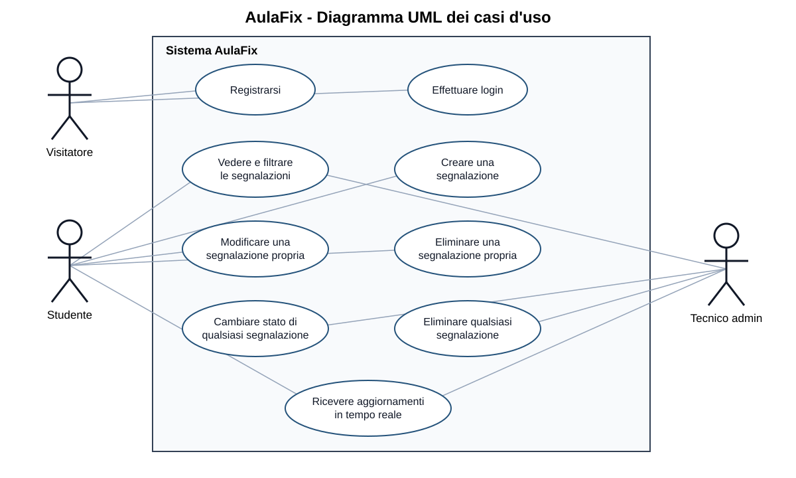
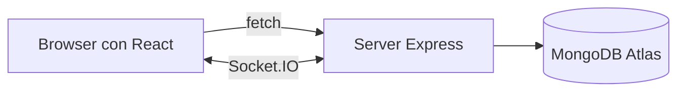
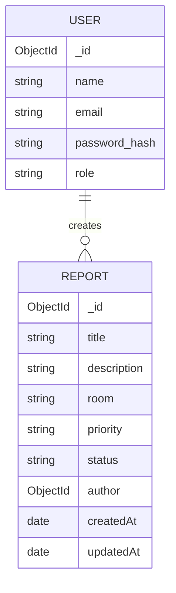
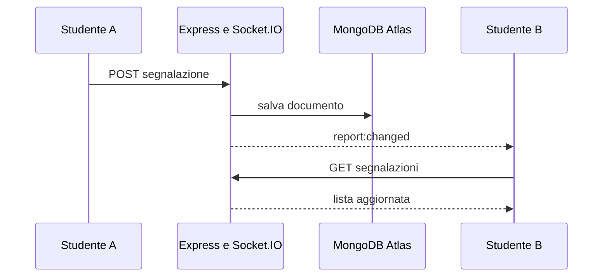

# Relazione tecnica - AulaFix

## 1. Scenario applicativo

AulaFix e una bacheca web per segnalare problemi nelle aule universitarie, per esempio un proiettore guasto, una presa non funzionante o una sedia rotta.

Un visitatore puo registrarsi o effettuare il login. Uno studente autenticato puo vedere le segnalazioni, filtrarle, crearne di nuove e gestire le proprie. Un tecnico con ruolo `admin` puo gestire tutte le segnalazioni.

L'applicazione e una Single Page Application. React crea l'interfaccia nel browser, il backend Express fornisce API JSON e MongoDB Atlas conserva i dati.

### Attori

- **Visitatore:** registrazione e login.
- **Studente:** lettura, filtri, creazione e gestione delle proprie segnalazioni.
- **Tecnico admin:** gestione di tutte le segnalazioni.



## 2. Architettura



Durante lo sviluppo React usa la porta 5173 ed Express la porta 5000. Il proxy di Vite inoltra le richieste `/api` e `/socket.io` al backend. In produzione Express serve anche i file creati dalla build di React.

Il progetto usa un'architettura monolitica semplice, adatta a un'applicazione didattica di piccole dimensioni.

### Struttura del codice

```text
AulaFix/
  backend/
    controllers/     funzioni CRUD
    middleware/      autenticazione ed errori
    models/           schemi Mongoose
    routes/           router Express
    server.js         avvio del server
    swagger.js        documentazione delle API
  frontend/
    src/App.jsx       stato generale ed effetti
    src/AuthForm.jsx  login e registrazione
    src/ReportForm.jsx form di inserimento
    src/Filters.jsx   filtri della lista
    src/ReportList.jsx lista e singola segnalazione
    src/api.js        funzione fetch comune
    src/style.css     CSS scritto da zero
  docs/               relazione e diagramma UML
```

## 3. Modello dei dati



### User

| Campo | Tipo | Regole |
| --- | --- | --- |
| `name` | String | obbligatorio, massimo 40 caratteri |
| `email` | String | obbligatorio, unico e in minuscolo |
| `password` | String | minimo 8 caratteri, salvato come hash bcrypt |
| `role` | String | `student` oppure `admin` |

### Report

| Campo | Tipo | Regole |
| --- | --- | --- |
| `title` | String | obbligatorio, massimo 80 caratteri |
| `description` | String | obbligatoria, massimo 300 caratteri |
| `room` | String | obbligatoria, massimo 30 caratteri |
| `priority` | String | `bassa`, `media` oppure `alta` |
| `status` | String | `aperta`, `in-lavorazione` oppure `risolta` |
| `author` | ObjectId | riferimento a un documento `User` |

La relazione tra utenti e segnalazioni e uno-a-molti. Ogni segnalazione contiene il riferimento al proprio autore.

## 4. API backend

Le rotte delle segnalazioni sono protette dal middleware `protect`. La documentazione Swagger interattiva si apre alla rotta `/api-docs`.

| Metodo | Rotta | Input | Protetta | Funzione |
| --- | --- | --- | --- | --- |
| POST | `/api/auth/register` | body: name, email, password | No | registra un utente |
| POST | `/api/auth/login` | body: email, password | No | effettua il login |
| POST | `/api/auth/logout` | cookie | No | elimina il cookie |
| GET | `/api/auth/me` | cookie | Si | restituisce l'utente corrente |
| GET | `/api/reports` | query: search, status, priority | Si | legge e filtra la lista |
| POST | `/api/reports` | body: dati della segnalazione | Si | crea una segnalazione |
| PUT | `/api/reports/:id` | parametro id e body | Si | modifica una segnalazione |
| DELETE | `/api/reports/:id` | parametro id | Si | elimina una segnalazione |

Le quattro operazioni CRUD sono rappresentate da GET, POST, PUT e DELETE.

### Query Mongoose

- `findOne` cerca un utente tramite email.
- `findById` cerca un utente o una segnalazione tramite id.
- `find` restituisce le segnalazioni applicando i filtri della query string.
- `populate` sostituisce il riferimento dell'autore con nome e ruolo.
- `sort` ordina le segnalazioni dalla piu recente.
- `create`, `save` e `deleteOne` modificano i documenti.

## 5. Middleware

- `express.json` legge i dati JSON inviati nel body.
- `cookieParser` rende disponibile il cookie del JWT.
- `protect` verifica il JWT, cerca l'utente e lo inserisce in `req.user`.
- `notFound` restituisce un errore per le rotte inesistenti.
- `errorHandler` gestisce gli errori di Mongoose e gli errori generici.

Il router delle segnalazioni usa `router.use(protect)`, quindi il middleware viene eseguito prima di tutte le sue rotte.

## 6. Autenticazione e autorizzazione

Durante la registrazione il middleware Mongoose `pre("save")` trasforma la password con bcrypt. La password originale non viene salvata.

Al login bcrypt confronta la password inserita con l'hash. Se le credenziali sono corrette, Express crea un JWT valido un giorno e lo salva in un cookie `httpOnly`. Il browser invia automaticamente il cookie nelle richieste successive.

Il middleware `protect` verifica la firma e la scadenza del JWT. Nei controller uno studente puo modificare ed eliminare soltanto le proprie segnalazioni, mentre l'admin puo gestirle tutte.

La registrazione assegna sempre il ruolo `student`, quindi un utente non puo registrarsi autonomamente come amministratore.

## 7. Frontend React

| Componente | Props principali | Compito |
| --- | --- | --- |
| `App` | nessuna | stato generale, effetti e funzioni CRUD |
| `AuthForm` | `onAuthenticated`, `showMessage` | login e registrazione |
| `ReportForm` | `onCreate` | form controllato per l'inserimento |
| `Filters` | valori e funzioni dei filtri | ricerca per testo, stato e priorita |
| `ReportList` | lista, utente e funzioni evento | rendering della lista con `map` e `key` |
| `ReportCard` | segnalazione, utente e funzioni evento | modifica ed eliminazione |

Il frontend mostra i concetti trattati durante il corso:

- rendering condizionale tra login e bacheca;
- props per passare dati e funzioni ai componenti figli;
- `useState` per utente, lista, filtri, form e messaggi;
- `onSubmit`, `onChange` e `onClick` per gli eventi;
- form controllati;
- `map` e `key` per la lista modificabile;
- filtri tramite input e select;
- `useEffect` per controllare la sessione, caricare i dati e aprire Socket.IO;
- `fetch` con `async/await` per comunicare con le API.

I componenti sono in file separati, come negli esempi del corso. Non sono usati Context, reducer, custom hook, React Router, Axios o librerie grafiche.

## 8. Interazione real-time

Il server crea un collegamento Socket.IO. Dopo una creazione, modifica o eliminazione, il controller invia l'evento `report:changed`. I browser collegati ricevono l'evento e richiedono nuovamente la lista tramite la normale API protetta.



L'evento Socket.IO non contiene dati dell'applicazione. Comunica soltanto che la lista e cambiata; i dati vengono sempre letti dall'API autenticata.

## 9. CSS

Il file `style.css` e scritto da zero. Usa soltanto regole elementari: colori, margini, padding, bordi e larghezza degli elementi. La pagina ha una sola colonna e non usa griglie, animazioni, framework CSS o librerie di componenti.

Questa scelta soddisfa la voce CSS della valutazione mantenendo una grafica volutamente semplice.

## 10. Deployment e tecnica avanzata

Il progetto evita microservizi, microfrontend, OAuth, refresh token, webhook, Kubernetes e altre architetture avanzate.

Rimane un semplice `Dockerfile` perche il servizio gia pubblicato su Render lo utilizza per costruire React, installare il backend e avviare Express. L'uso del container puo essere presentato come unica tecnica avanzata della tabella di valutazione. La rotta `/api/health` permette a Render di controllare se il servizio e attivo.

Le credenziali del database e il segreto JWT non sono scritti nel codice, ma sono inseriti nelle variabili d'ambiente `MONGO_URI` e `JWT_SECRET`.

## 11. Verifica rispetto alla valutazione

| Obiettivo | Evidenza nel progetto |
| --- | --- |
| API Express | router, middleware e controller CRUD |
| Frontend React | componenti, props, stato, eventi, liste, filtri, effect e fetch |
| CSS from scratch | foglio semplice senza librerie |
| Autenticazione e sessione | bcrypt, JWT e cookie `httpOnly` |
| Real-time | Socket.IO con evento `report:changed` |
| Deployment | applicazione pubblicata su Render |
| Tecnica avanzata | solo il container usato per il deployment |
| Documentazione e Swagger | relazione, UML e `/api-docs` |

## 12. Demo da mostrare al professore

1. Aprire il sito pubblicato su Render.
2. Accedere come studente.
3. Creare una segnalazione e utilizzare i tre filtri.
4. Modificare il titolo e lo stato, poi eliminare una segnalazione propria.
5. Aprire una seconda finestra per mostrare l'aggiornamento real-time.
6. Accedere come admin e mostrare che puo gestire tutte le segnalazioni.
7. Aprire Swagger alla rotta `/api-docs`.
8. Mostrare il percorso router, middleware, controller e query Mongoose.
9. Mostrare un componente React con props, stato, evento ed effect.

## 13. Credenziali di test

Dopo l'esecuzione di `npm run seed`:

- studente: `studente@aulafix.it` / `Studente123!`
- tecnico admin: `admin@aulafix.it` / `Admin123!`
